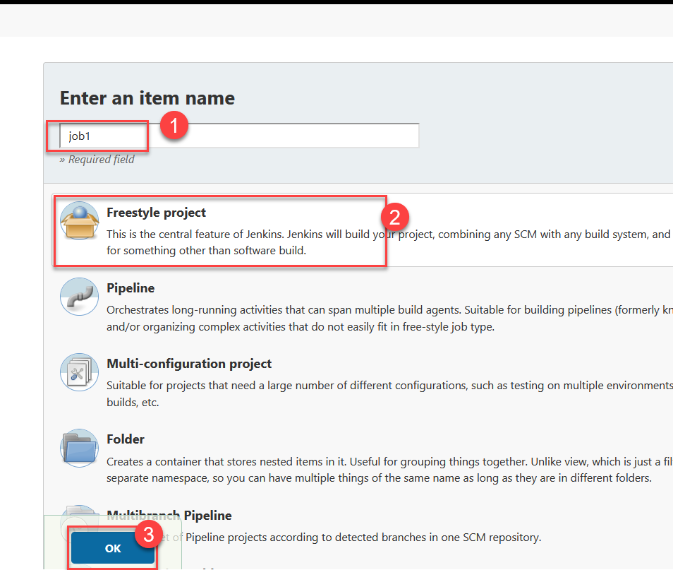
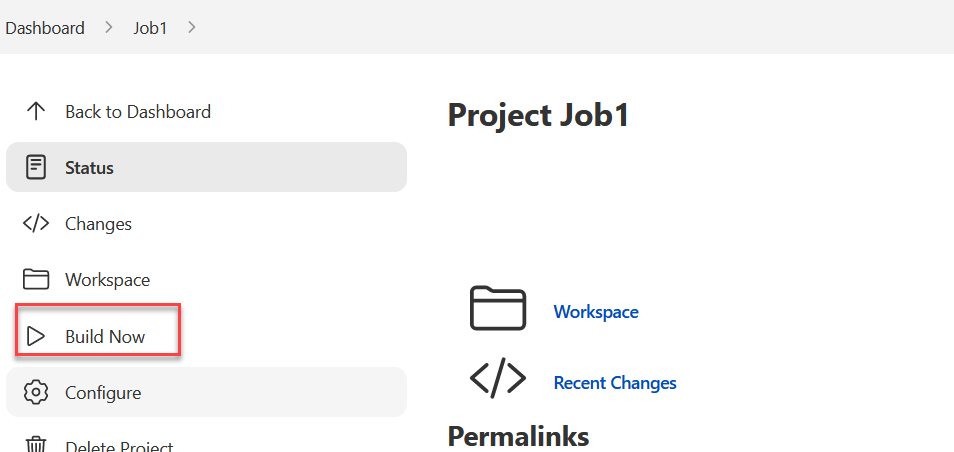

## Demo : Jenkins Job 

1. Visit github.com and login with your account and Visit repository: https://github.com/mahendra-shinde/ci-servlet-demo

1. Use "fork" button to create your copy of this repo https://github.com/YOURNAME/ci-servlet-demo

	

1. Now, copy your repository url from address bar, it should be similar to `https://github.com/YOURNAME/ci-servlet-demo`

1. Login into jenkins portal

	

	> Use your login name and password, you set while installing jenkins.

1. Click on `New Item` to create new jenkins job.

	

1. Create new job with name `job1` and type `Freestyle project`

	

1. Now, Click on "Source Code Management` tab and choose `Git` and use your github repository URL
	

1. Now, click on `Build` Tab and choose `Top Level Maven target`

	

1. Choose maven version `M3` or `M2` and then Goal should be `package` 

	> You could use `package -DskipTests` to skip all JUnit tests and save build time !!

	

1. Goto `Post Build Actions` Tab and choose `Archive the artiacts` Task from drop down list

	

1. Now, enter path `target/*.war` and click `Save` button.

	

1. Now, start the first build by using button `Build Now`

	
