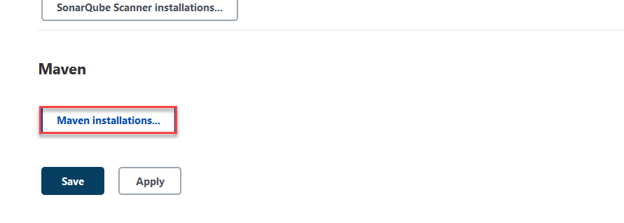

## Jenkins : Post Setup Configuration

> Jenkins must be installed and running.

1. Login into jenkins dashboard
1. Click on `Manage Jenkins` button
	
	

1. In Jenkins Management dashboard, choose option `Global Tool configuration`

	

1. Now, you need to set JDK, Maven and Git path

	> No additional config for `git` is required, jenkins will auto-detect path for git

1. The first tool to configure is `JDK` use button `JDK Installations...` to set Java Home path.

	

1. Now, Set `Name` to `Java-8` and in JAVA_HOME provide path to Java 8 installation in your system (The path would be same, just the jdk version might be different on your system). 

	

1. Now, scroll down to set Maven, use name `M3` and Maven home should be set to folder where you have extracted apache maven.

	
	
	