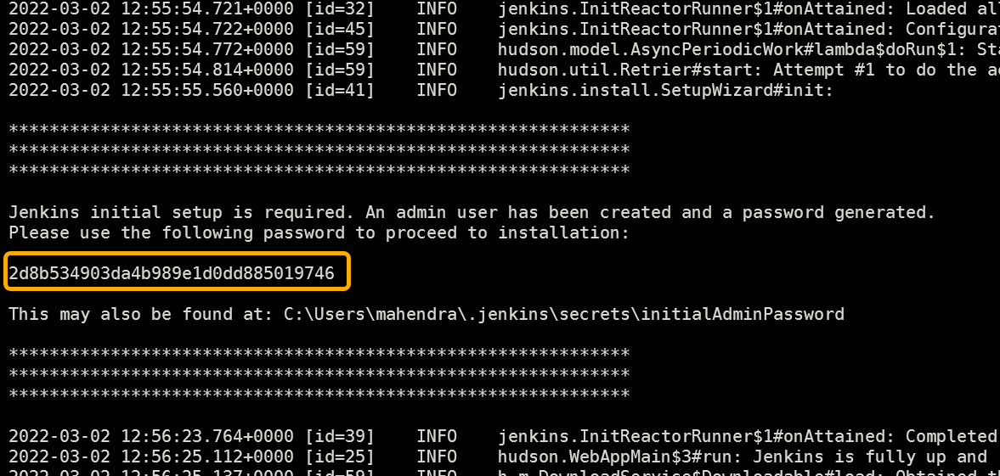

# Demo: Jenkins Setup

1. Download the jenkins https://get.jenkins.io/war-stable/2.361.2/jenkins.war

1. Verify java version and then launch jenkins on standard port 8080

	```bash
	java -version
	cd downloads     # Folder where WAR file is downloaded !!
	java -jar jenkins.war
	```

	> In case you cant run jenkins on default port `8080` then use following command to launch it in another port eg 9000

	```bash
	java -jar jenkins.war --httpPort=9000
	```

1. Jenkins log should now display the one time secret 
	> The logs would be visible on your terminal / command prompt.

	

1. Copy the password from terminal.

1. Visit `http://localhost:8080` using web browser. And it should ask you for "InitialAdminPassword"
Paste password here (copied from terminal)

	

1. Now, click "Install Suggested Plugins"

	

1. Click `next` and provide user details to created new admin user.

	

1. Click `Finish` button to start using jenkins.

	
